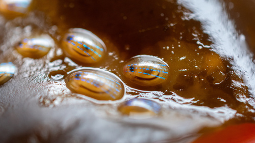
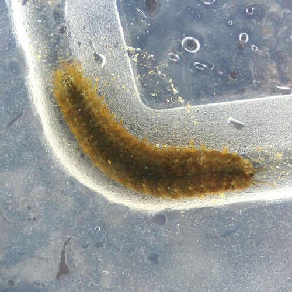

```{r setup, include=FALSE}
knitr::opts_chunk$set(echo = FALSE, message=FALSE, warnings=FALSE)
```

# Rock Pool Project Team Bioblitz - Autumn 2023

We are had a competition to record as many species as possible over the weekend of the 30th Sept/1st Oct. This weekend included team rock pooling events in Falmouth and Plymouth, but participants were able to record data over the whole weekend.

As well as this collective challenge, we were competing against each other in three separate teams:

* [Falmouth](https://www.inaturalist.org/projects/team-bioblitz-challenge-falmouth)
* [Plymouth](https://www.inaturalist.org/projects/team-bioblitz-challenge-plymouth)
* [Rest of the World](https://www.inaturalist.org/projects/team-bioblitz-challenge-rest-of-the-world)

All data were recorded via [Inaturalist](https://www.inaturalist.org), a world leading biodiversity data submission hub, which provides the facility to record data together as 'projects'. For this team bioblitz challenge we structured the three teams into three seperate project (links in bullet points above) and colated all three projects together under an umberella project called '[The Rock Pool Project Team Bioblitz](https://www.inaturalist.org/projects/the-rock-pool-project-team-bioblitz)'. This allows inaturalist to present key results such as how many records and species have been recorded, both overall and per team.

Another key advantage of inaturalist is it's community approach to [data verification](https://www.inaturalist.org/posts/26549-what-is-a-verifiable-observation-and-how-does-it-reach-research-grade). This is important as we want our data to be as accurate as possible, while minimising technical complications for participants. We decided that we should aim for all records to achieve inaturalists 'Research Grade' category and to work together as a community to achieve this. We set a deadline of 10pm the Wednesday after the bioblitz challenge to finish verification and downloaded all the data at this point.

Before the event we decided that there would be awards for the following:

* Team with the most species
* Team with the most records
* Team with the most unique species
* Individual with the most species
* Individual with the most records
* Individual with the most unique species

Inaturalist provides some of this information but only based on all the records collects, not specifically for records that were verified to Research Grade status. I have downloaded all the data from inaturalist and subsetted it  to just the research grade records to then determine the winners of these awards, as well as the overall results, based on these records.

If you are into coding in R, you can find a version of this report with the code embedded [here](https://rpubs.com/hamletben/bioblitzcode1)

```{r data load}
#load in data
RPP_bioblitz_data <- read.csv("observations-363726.csv") #downloaded on the 5th October 2023

#subset to research grade

RPP_bioblitz_data_RG <- subset(RPP_bioblitz_data, quality_grade == "research")


```

## Overall results

```{r overall_RG_rec_res, results="hide"}

nrow(RPP_bioblitz_data_RG) #total number of records

length(unique(RPP_bioblitz_data_RG$scientific_name)) #number of species

length(unique(RPP_bioblitz_data_RG$user_login)) #number of contributors 

```

As of the 4th October, we had **384** research grade records for a total of **202** species, collected by **13** different people. What an amazing effort! Well done everyone!

## Individual results

```{r team_RG_rec_res, warnings=FALSE}
#most records
ind_rec_num <- sort(table(RPP_bioblitz_data_RG$user_login), decreasing = T) #a table of how many records per person

#most species
ind_sp_num <- rep(0, length(ind_rec_num)) #make a blank result object
names(ind_sp_num) <- names(ind_rec_num) #add the participant names

#loop through each person a record how many species they found

for (p in names(ind_sp_num)) {
  
  p_res <- subset(RPP_bioblitz_data_RG, user_login == p)
  
  ind_sp_num[p] <- length(unique(p_res$scientific_name))
  
    
}

#unique species records

recs_per_species <- table(RPP_bioblitz_data_RG$scientific_name) #table of the number of records for each species
unique_species <- names(recs_per_species)[recs_per_species == 1] # vector of just the species with only one record

RPP_bioblitz_data_RG_unique <- subset(RPP_bioblitz_data_RG, scientific_name %in% unique_species) # subset the data based on the species only recorded once

#most unique records

ind_rec_num_unique <- sort(table(RPP_bioblitz_data_RG_unique$user_login), decreasing = T) #a table of how many records per person for the unique species records

#combine all these results into a single table
ind_rec_num_unique <- ind_rec_num_unique[names(ind_sp_num)] #sort to match other results
names(ind_rec_num_unique) <- names(ind_rec_num)
ind_rec_num_unique[is.na(ind_rec_num_unique)] <- 0 #replace NAs with zeros


ind_res <- cbind("Records" = ind_rec_num, "Species" = ind_sp_num, "Unique Species" = ind_rec_num_unique)

defaultW <- getOption("warn") 

options(warn = -1) 
library(DT)
options(warn = defaultW)
datatable(ind_res)%>% formatStyle(
  'Records',
  backgroundColor = styleEqual(sort(ind_rec_num, dec = T)[1:3], c('gold', 'gray', rgb(205, 127, 50, maxColorValue =  255)))
)%>% formatStyle(
  'Species',
  backgroundColor = styleEqual(sort(ind_sp_num, dec = T)[1:3], c('gold', 'gray', rgb(205, 127, 50, maxColorValue =  255)))
)%>% formatStyle(
  'Unique Species',
  backgroundColor = styleEqual(sort(ind_rec_num_unique, dec = T)[1:3], c('gold', 'gray', rgb(205, 127, 50, maxColorValue =  255)))
)

```

Many congratulations to Rebecca Bowyer for taking gold medal for the most records and also the most species, with an incredible 93 records and 77 species. Cath Francis and Jen Sutton takes silver and bronze respectively in both these categories. These three also shared the medals in the 'Most Unique Species' category, with Jen nipping in front of Rebecca for gold, finding 29 species that nobody else recorded. Without doubt three nature recording superstars!

Honourable mentions also goes to Team Plymouth's top recorder Zak Russell, the Rest of the World's top recorder Amy Borland, who provided the Rock Pool Project most northerly records to date from Orkney, and finally Alan Smith who provided the Rock Pool Project's most southerly records to date from the UAE!

## Team results

```{r team data load, results="hide"}
#load in data
Fal_bioblitz_data <- read.csv("observations-363831.csv") #downloaded on the 5th October 2023
Ply_bioblitz_data <- read.csv("observations-363870.csv") #downloaded on the 5th October 2023
RoW_bioblitz_data <- read.csv("observations-363833.csv") #downloaded on the 5th October 2023

#subset the research grade data

Fal_bioblitz_data_RG <- subset(RPP_bioblitz_data_RG, user_login %in% Fal_bioblitz_data$user_login)
Ply_bioblitz_data_RG <- subset(RPP_bioblitz_data_RG, user_login %in% Ply_bioblitz_data$user_login)
RoW_bioblitz_data_RG <- subset(RPP_bioblitz_data_RG, user_login %in% RoW_bioblitz_data$user_login)

#check the team data matches up with the overall data
sum(c(nrow(Fal_bioblitz_data_RG),nrow(Ply_bioblitz_data_RG),nrow(RoW_bioblitz_data_RG))) == nrow(RPP_bioblitz_data_RG)

#add team attribute column
RPP_bioblitz_data_RG$Team <- "Falmouth"
RPP_bioblitz_data_RG$Team[RPP_bioblitz_data_RG$user_login %in% Ply_bioblitz_data$user_login] <- "Plymouth"
RPP_bioblitz_data_RG$Team[RPP_bioblitz_data_RG$user_login %in% RoW_bioblitz_data_RG$user_login] <- "Rest of the World"

```


```{r team results}
#most records
barplot(sort(table(RPP_bioblitz_data_RG$Team), decreasing = T), col = c('gold', 'gray', rgb(205, 127, 50, maxColorValue =  255)), main = "Research Grade Records")

#most species
team_sp_num <- rep(0, 3) #make a blank result object
names(team_sp_num) <- unique(RPP_bioblitz_data_RG$Team) #add the team names

#loop through each person a record how many species they found

for (i in names(team_sp_num)) {

   team_sp_num[i] <- length(unique(subset(RPP_bioblitz_data_RG, Team == i)$scientific_name))
    
}

barplot(sort(team_sp_num, decreasing = T), col = c('gold', 'gray', rgb(205, 127, 50, maxColorValue =  255)), main = "Research Grade Species")

#unique species
team_u_sp_num <- rep(0, 3) #make a blank result object
names(team_u_sp_num) <- unique(RPP_bioblitz_data_RG$Team) #add the team names

RPP_bioblitz_data_RG_unique <- subset(RPP_bioblitz_data_RG, scientific_name %in% unique_species) # redo this object to include team names

#loop through each person a record how many species they found

for (i in names(team_u_sp_num)) {

   team_u_sp_num[i] <- length(subset(RPP_bioblitz_data_RG_unique, Team == i)$scientific_name)
    
}

barplot(sort(team_u_sp_num, decreasing = T), col = c('gold', 'gray', rgb(205, 127, 50, maxColorValue =  255)), main = "Research Grade Unique Species")

```

Golds all round for Team Falmouth! Brilliant stuff guys!!!

## Other awards

We also discussed two other possible awards: best species and best picture.

### Best picture

```{r image_download, results="hide"}

if(!dir.exists("Images")){
dir.create("Images")
  
}

defaultW <- getOption("warn") 

options(warn = -1) 
library(exifr)
options(warn = defaultW)


record_ids <- RPP_bioblitz_data_RG$id

images_already_downloaded <- list.files("Images")

all_im_file_names <- paste0(paste(RPP_bioblitz_data_RG$common_name,RPP_bioblitz_data_RG$scientific_name, RPP_bioblitz_data_RG$user_login, sep = " - "),".jpg")

records_with_images_not_downloaded <- all_im_file_names[!all_im_file_names %in% images_already_downloaded]


for(i in records_with_images_not_downloaded){
  im_dat <- subset(RPP_bioblitz_data_RG, id == i)
  image_url <- im_dat$image_url
  
  image_dest <- paste0("Images/", paste(im_dat$common_name,im_dat$scientific_name, im_dat$user_login, sep = " - "),".jpg")
  try(download.file(image_url, image_dest, mode = "wb"))
  
}


```

Best picture can only be a subjective decision. I have downloaded all the images for the research grade records and uploaded these images to the Rock Pool Project FlickR account [here](https://flic.kr/s/aHBqjAXzeV).

My personal favourite is this one from Vicky Barlow:


Let us know what your favourite is!

## Best species

One way to determine the 'best species' is to base this decision on the species with the fewest current records on inaturalist. There is an R package called rinat that provides an interface with inaturalist and can obtain this information by downloading all the records for a specified species. These results can be subsetted by location but for this challenge I will just base this analysis on total number of observations across the world, since we do have records from all over the world.

```{r obs_num}

defaultW <- getOption("warn") 

options(warn = -1) 
library(rinat)
options(warn = defaultW)


RPP_RG_spp <- unique(RPP_bioblitz_data_RG$scientific_name)

load("sp_inat_rec_num") #previously generated results

#any species not currently included?

missing_sp <- RPP_RG_spp[!RPP_RG_spp %in% names(sp_inat_rec_num)]

if (length(missing_sp) > 0) { #add missing species to results
sp_inat_rec_num_missing <- rep(0, length(missing_sp))
names(sp_inat_rec_num_missing) <- missing_sp
  sp_inat_rec_num <- c(sp_inat_rec_num, sp_inat_rec_num_missing)
  
  for (sp in missing_sp) {
  print(which(RPP_RG_spp == sp)/length(RPP_RG_spp))
  
  inat_search <- try(sp_inat_rec_num[sp] <- get_inat_obs(sp, maxresults = 10, meta = T)$meta$found)

  if(!is.null(attr(inat_search, "class"))){
    sp_inat_rec_num[sp] <- 200000 #species with close to 200k records cause an error, so set this as the maximum
  }
  save(sp_inat_rec_num, file = "sp_inat_rec_num")

}
}

#convert into a score out of 10, 1 = min, to 2 dp, with 10 being rarest, 1 = 200000+ records

##rescale to 0 to 1
temp_score <- (sp_inat_rec_num - min(sp_inat_rec_num))/(max(sp_inat_rec_num) - min(sp_inat_rec_num))
##reverse
temp_score <- 1 - temp_score
#convert to 1 to 10
inat_sp_scores <- round((9 * temp_score) + 1, 3)

hist(inat_sp_scores, main = "Scores for all species found on Rock Pool Project Bioblitz", xlab = "Ben's latest scoring system")

best_sp <- head(sort(inat_sp_scores, decreasing = T))

#who found these species

best_finds <- subset(RPP_bioblitz_data_RG, scientific_name %in% names(best_sp))[,c("scientific_name", "user_login")]

best_finds$score <- inat_sp_scores[best_finds$scientific_name]
best_finds$records <- sp_inat_rec_num[best_finds$scientific_name]

#sort in descending order
best_finds <- best_finds[order(best_finds$scientific_name, decreasing = T),]

best_finds <- best_finds[order(best_finds$score, decreasing = T),]

datatable(best_finds)

```

I've converted the number of records to a scoring system ranging from 1 to 10, with 1 being the most common species and 10 being the rarest. This scoring system isn't great as most species have values close to 10, since most species are rarely recorded. But we'll go with it for now. 

*Ostrea conchaphila* is a mis-identification, so Rebecca wins this one as well with her *Harmothoe impar* record. Well done Rebecca!!

Here it is:



#### Overall a wonderful weekend discovering nature. Many thanks to everyone who took part. I was very impressed with how inaturalist helped us all to record and share our finds, as well as giving us support with verification. Over 100 people from the inaturalist community have helped us to ID the species with found.